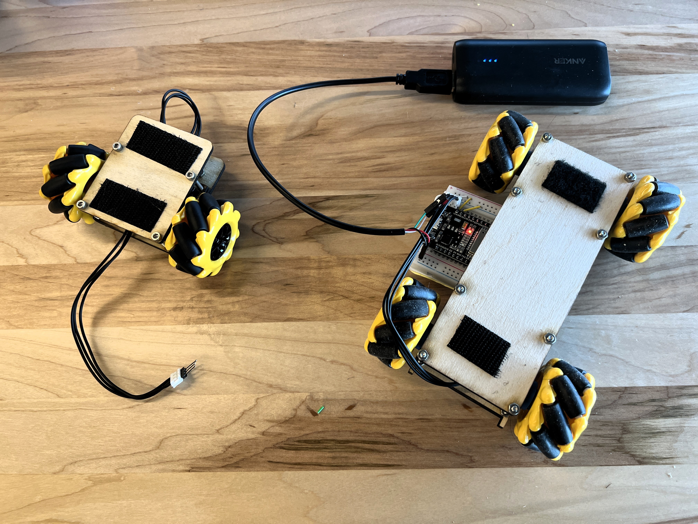

# micro_movement

Template to build customized robot with Dynamixel 330 motors and ESP32 (For ESP32-CAM, check out [here](https://github.com/FrankBu0616/esp32cam_ros)). Motor control is managed by micro-ROS. Therefore, heavy computation can be off-load elsewhere. The goal of this repo is to provide a template to control small robots (power by micro-controllers) with ROS 2.

The Dynamixle Motor interface is based on Dr. Rei Lee's [Dynamixel_XL330_Servo_Library](https://github.com/rei039474/Dynamixel_XL330_Servo_Library).

To run the template, PlatformIO IDE is required.

 


## Hardware

- [Dynamixel 330](https://www.robotis.us/dynamixel-xl330-m077-t/) (x 2)
- [ESP32-dev board](https://www.amazon.com/gp/product/B08246MCL5/ref=ppx_yo_dt_b_search_asin_title?ie=UTF8&th=1)
- [small battery](https://a.co/d/cCPNhDv) 
- jumper wires
- material of your choice for the chassis
- a host laptop running linux

## Software Requirement
- [PlatformIO](https://platformio.org/platformio-ide) (VS Code IDE)
- [micro-ROS](https://micro.ros.org/docs/tutorials/core/first_application_linux/) (Only need the micro-ros agent on host machine.)
- [ROS 2 Humble](https://docs.ros.org/en/humble/index.html)

## Setup
- Motors
To setup the motors, you can either use a [U2D2](https://www.robotis.us/u2d2/) and the [wizard app](https://emanual.robotis.com/docs/en/software/dynamixel/dynamixel_wizard2/), or you can use an esp32 with the example script located in `lib/XL330/examples/xl330_baud_rate_and_id`. 
> - Motor 1
    - ID: 1
    - baudrate: 115200
> - Motor 2
    - ID: 2
    - baudrate: 115200

I am using Serial2 to communicate, so all you need to do is connect motor1's data pin to `TX2` and `RX2` on the board.

## Communication
Details on transport configuration can be found [here](https://github.com/micro-ROS/micro_ros_platformio#transport-configuration).

- wifi
> To enable wifi, you need to make sure  `board_microros_transport` is set to `wifi` in `platformio.ini`. Then, put your wifi credentials in the `setup()` function in `main.cpp`.
```py
IPAddress agent_ip(192, 168, 1, 7);
size_t agent_port = 8888;
char ssid[] = "WIFI_NAME";
char psk[]= "PASSWORD"
set_microros_wifi_transports(ssid, psk, agent_ip, agent_port);
```
- Serial
> To enable wifi, you need to make sure  `board_microros_transport` is set to `wifi` in `platformio.ini`. Then, put your wifi credentials in the `setup()` function in `main.cpp`.

```py
Serial.begin(115200);
set_microros_serial_transports(Serial);
```
- micro-ros agent
`micro-ros agent` is required to communicate between the host computer and the esp32. There are mainly two ways to run micro-ros agent on your host machine.
1. Docker
```bash
# UDPv4 micro-ROS Agent
docker run -it --rm -v /dev:/dev -v /dev/shm:/dev/shm --privileged --net=host microros/micro-ros-agent:$ROS_DISTRO udp4 --port 8888 -v6
# Serial micro-ROS Agent
docker run -it --rm -v /dev:/dev -v /dev/shm:/dev/shm --privileged --net=host microros/micro-ros-agent:$ROS_DISTRO serial --dev [YOUR BOARD PORT] -v6
```
2. Locally on host machine (Linux only)
> Folllow the tutorial [here](https://micro.ros.org/docs/tutorials/core/first_application_linux/) (under the section title **Creating the micro-ROS agent**) to setup micro-ros agent workspace on your host machine. 
```bash
source install/setup.bash
# UDPv4 (wifi): 
ros2 run micro_ros_agent micro_ros_agent udp4 --port 8888
# Serial 
ros2 run micro_ros_agent micro_ros_agent serial --dev /dev/ttyUSB0 baudrate=115200`
```
Modify your parameters accordingly.

## Code Structure
- customized ROS packages, such as messages and services, should go under `/extra_packacges`. If you make changes to these packages, you must rebuild ROS.
- external libraries should live under `/lib` following the structure specified in `/lib/README`
- `main.cpp` contains the actual execution. `setup()` run only once and should be used to initialize ROS nodes. `loop()` function should spin the executors.

### Topics
There are two available topics in this example,
-`dynamixel_position_publisher` publishing the joint position of the first motor.
-`goal_command` is used to receive goal positions/velocities.
- Currently, I defined a new ROS message called `GroupCommand`, which is simply a integer array. The size of the array depends on the number of motors you are controlling. 

Note, you must pre-allocate enough memory space for your message. In the following example, I am controlling 2 motors, so I allocated space for a size-2 integer array.
```py
custom_interfaces__msg__GroupCommand command_msg;

void setup():
    ...
    command_msg.values.capacity = 2;
    command_msg.values.data = (int32_t*) malloc(command_msg.values.capacity * sizeof(int32_t));
    command_msg.values.size = 0;
```

### Services
- `changemode` ROS service is available to change control modes. Right now, the code only supports position control and velocity control. But you can easily modify the code to adapt to other modes.

``` bash
# On host computer
# velocity control
ros2 service call /changemode custom_interfaces/srv/ChangeMode "{mode: 1}" 

# position control
ros2 service call /changemode custom_interfaces/srv/ChangeMode "{mode: 3}"
```
