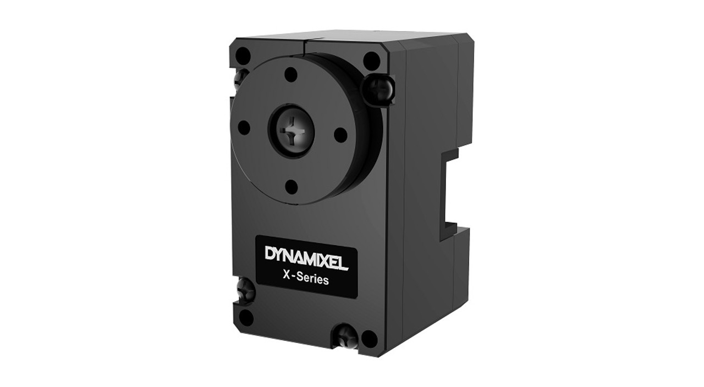
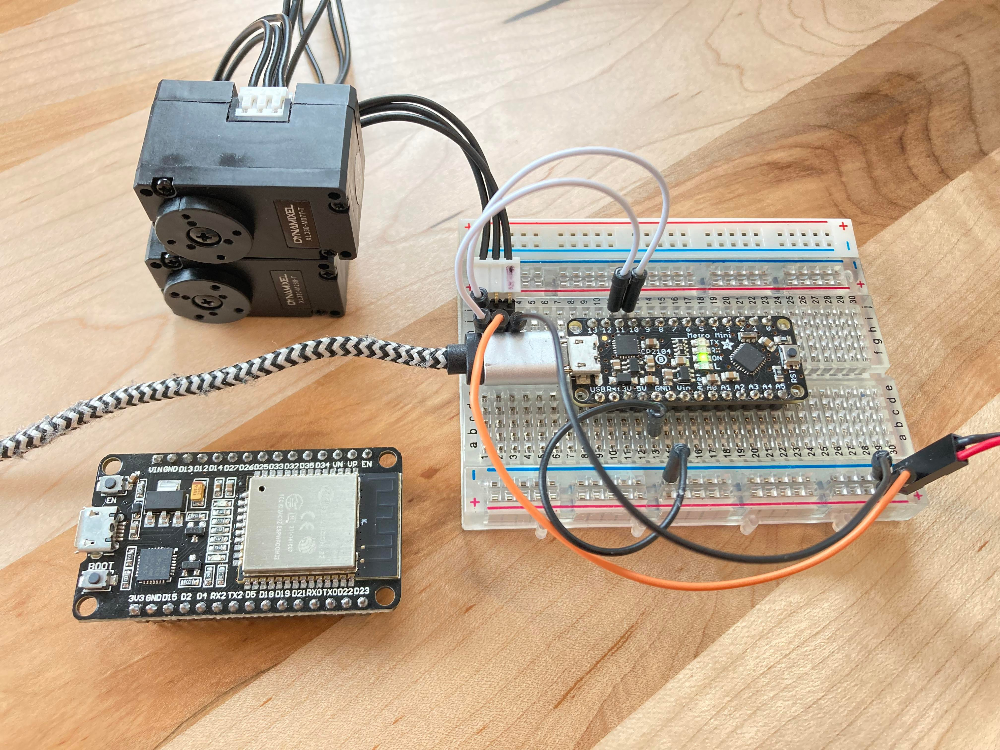
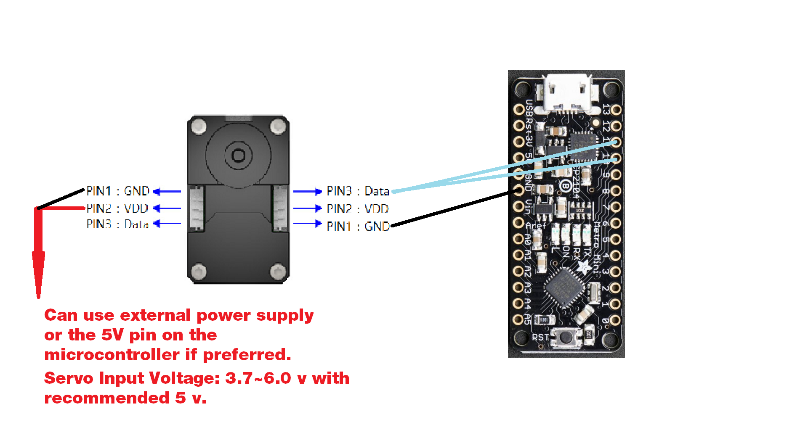

Dynamixel XL-330
================
This library is developed based on the code from [hackerspace-adelaide/XL320](https://github.com/hackerspace-adelaide/XL320). The modification is made by [Rei Lee](mailto:wl593@cornell.edu).


This is a library created to control Dynamixel XL-330 servos directly with microcontrollers. It works for both [XL330-M077-T](https://emanual.robotis.com/docs/en/dxl/x/xl330-m077/) and [XL330-M288-T](https://emanual.robotis.com/docs/en/dxl/x/xl330-m288/) models and has been tested with Arduino and ESP32 boards. Please refer to Dynamixel website for more info about the servos.

**It is still work in progress... not ready yet, but can be used for simple PWM and Position control.**






# A XL-330 Servo library for Arduino

Clone this repository into your Arduino IDE libraries folder:

``` $ cd ~/Documents/Arduino/libraries/ ```

Restart Arduino IDE after. Open the XL330 example sketches to see how they work:

``` Arduino IDE > File > Examples > XL330-master ```

---------------


## Hardware

Please refer to the e-manual for either [XL330-M077-T](https://emanual.robotis.com/docs/en/dxl/x/xl330-m077/) or [XL330-M288-T](https://emanual.robotis.com/docs/en/dxl/x/xl330-m288/) for detailed specifications and communication addresses from the Control Table of EEPROM Area.

---------------

## Wiring Diagram

XL330 servos can be connected in series and controlled at once.


* PIN1: GND
* PIN2: VDD (5 volts)
* PIN3: Data Serial RX TX

When connecting to a microcontroller, the servo's Data pin will be connected to both the desired RX and TX pins. Depends on the code, they can be defined hardware serial pins or software serial pins. The wiring diagram below is based on the example code provided in the library.



---------------

## Example Sketches

I have included some example sketches to help setup and test your servos. **All the example sketches are made for Arduino board, if using other microcontrollers, make sure the libraries used in the sketches are compatible for your board**. For example, the ```<SoftwareSerial.h>``` library does not work on EPS32 Board, need to be changed to ```<HardwareSerial.h>``` and declare the RX TX pins differently.


### [Setting Servo's Serial Baud Rate & ServoID](https://github.com/rei039474/XL330_Microcontroller_Library/tree/master/examples/xl330_baud_rate_and_id)

The out-of-box servo comes with default Baud Rate(8) = 57600 bps and default ServoID(7) = 1. 

**Set up one servo at a time to desired ServoID without connecting several of them in series.**

```XL330_baud_rate_and_id.ino```

Follow the instructions in the example sketch and change the setting based on your own needs. After uploading the sketch, remember to power-cycle the microcontroller in between setting anything.

NOTE: The example sketch includes the blinking of LED on the servo as an indicator of whether the setting successfully changes.

===============

### [Simple Position Control with Potentiometer](https://github.com/rei039474/XL330_Microcontroller_Library/tree/master/examples/xl330_position_control)

The out-of-box servo comes with default Operating Mode(11) = 3. Position Control Mode.

Operating Mode Options: 0: current; 1: velocity; 3: position; 4: extended position; 5: current-base position; 16: PWM

```XL330_position_control.ino```

I used a potentiometer as the input value in the sketch, but you can send command with value directly if wanted.

The value range for [XL330 position control](https://emanual.robotis.com/docs/en/dxl/x/xl330-m077/#goal-position116) is ```0 ~ 4095``` mapping ```0 ~ 360 [°]```  with following command line:

```robot.setJointPosition(servoID, value);```

===============

### [Simple PWM Control with Potentiometer](https://github.com/rei039474/XL330_Microcontroller_Library/tree/master/examples/xl330_PWM_control)

The out-of-box servo comes with default Operating Mode(11) = 3. Position Control Mode.

Operating Mode Options: 0: current; 1: velocity; 3: position; 4: extended position; 5: current-base position; 16: PWM

```XL330_PWM_control.ino```

I used a potentiometer as the input value in the sketch, but you can send command with value directly if wanted.

The value range for [XL330 PWM control](https://emanual.robotis.com/docs/en/dxl/x/xl330-m077/#goal-pwm100) is ```-885 ~ 885``` with following command line:

```robot.setJointSpeed(servoID, value);```

---------------

## More information

The example sketches provide the preset commands for XL330. If you want to control other settings on different addresses, check the address value from [XL330 Address Table](https://emanual.robotis.com/docs/en/dxl/x/xl330-m077/#control-table-of-eeprom-area), and use the following command line with corresponding data size for the address:

```
//for sending 2 bytes data 
robot.sendPacket(int id, int Address, int value);

//for sending 1 byte data 
robot.sendPacket_1byte(int id, int Address, int value);

//for sending 4 bytes data 
robot.sendPacket_4bytes(int id, int Address, int value);
```
